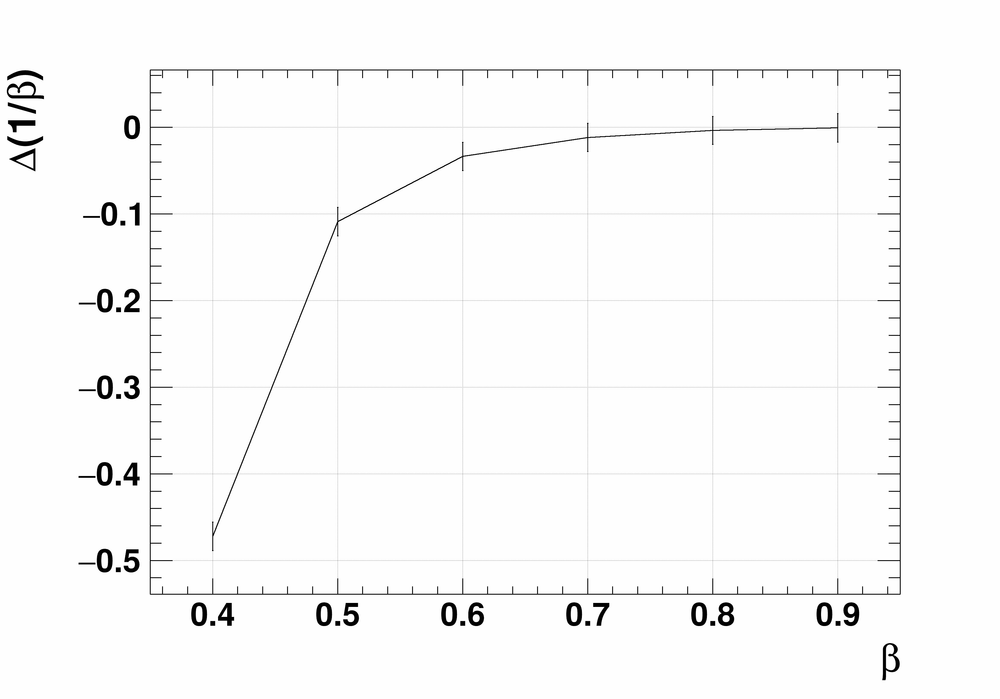

<div align="center">
  <h1>AMS飞行时间探测器的粒子速度非线性重建方法研究</h1>
  
  [](README_EN.md) [](README.md)
</div>

---
**第一阶段**
> 本阶段的工作内容：
> 1. 为后续阶段提供基础代码
> 2. 实现了零磁场、粒子垂直入射的蒙特卡罗模拟方法
> 3. 使用线性重建方法尝试重建，并展示了线性重建的效果
>
> 
>
> 更具体的内容可以下载作者[本阶段的报告](presentation/Stage：零磁场垂直入射线性重建.pptx)。

## 项目介绍

本项目旨在研究阿尔法磁谱仪（AMS）飞行时间探测器（TOF）中粒子速度的非线性重建方法。AMS是一个在国际空间站上运行的粒子物理实验，TOF探测器用于测量带电粒子的飞行方向和速度。然而，由于带电粒子在TOF材料中发生电离能量损失，导致粒子减速。如果使用线性函数拟合粒子的时间-空间关系，会导致粒子速度重建存在一定偏差，特别是在低能时更加明显。

本研究通过在粒子速度拟合过程中引入粒子能量损失项，进行非线性拟合，以减少速度重建的偏差并提高精度。这将有助于AMS更准确地鉴别核同位素。

## 摘要

阿尔法磁谱仪（AMS）是在国际空间站上运行的粒子物理实验。AMS的飞行时间探测器（TOF）用于测量带电粒子的飞行方向和速度。由于带电粒子在TOF材料中发生电离能量损失，导致粒子减速。如果使用线性函数拟合粒子的时间-空间关系，会导致粒子速度重建存在一定偏差，特别是在低能时更加明显。本研究拟在粒子速度拟合过程中引入粒子能量损失项，进行非线性拟合，以减少速度重建的偏差并提高精度，从而有助于AMS鉴别核同位素。

## 相关信息
1. AMS-02 所用的 TOF 的闪烁体探测器：[EJ-200](https://eljentechnology.com/products/plastic-scintillators/ej-200-ej-204-ej-208-ej-212)
2. 一些材料的性质可以通过[Atomic and Nuclear Properties of Materials](https://pdg.lbl.gov/2024/AtomicNuclearProperties)查询
3. [NIST ESTAR 程序](https://physics.nist.gov/PhysRefData/Star/Text/ESTAR.html)可以用于计算电子的停止力、密度效应修正参数等。

## 使用方法（对于新手）
**注意：该方法并未考虑鲁棒性，仅仅针对让您实现和作者相同的环境！！**

> 作为参考：  
> 作者使用的系统：Windows 11 专业工作站版（26100.2894）

1. 前往[此处](https://code.visualstudio.com/Download)下载安装合适版本的 [Visual Studio Code (VS Code)](https://code.visualstudio.com/)。
2. 打开VS Code，下载插件：[Remote - SSH](https://marketplace.visualstudio.com/items?itemName=ms-vscode-remote.remote-ssh)、[WSL](https://marketplace.visualstudio.com/items?itemName=ms-vscode-remote.remote-wsl) 和 [Chinese (Simplified) (简体中文) Language Pack for Visual Studio Code](https://marketplace.visualstudio.com/items?itemName=MS-CEINTL.vscode-language-pack-zh-hans)（如果您更喜欢中文）。
3. 右键Windows图标，打开终端管理员，执行命令 `wsl --install` 以自动下载 [Windows Subsystem for Linux (WSL)](https://learn.microsoft.com/en-us/windows/wsl/)，成功后请重启。或参考[此处](https://learn.microsoft.com/en-us/windows/wsl/install-manual)进行手动下载。若在自动下载过程中出现任何问题，请参阅[手动下载](https://learn.microsoft.com/en-us/windows/wsl/install-manual)步骤。
4. （可选）在 `C:\Users\<你的用户名>` （可以直接在文件资源管理器中输入 `%USERPROFILE%` 并按下 `Enter` ）下，新建文本文档，并打开，键入以下内容：
   ```
   [experimental]
   autoMemoryReclaim=gradual
   networkingMode=mirrored
   dnsTunneling=true
   firewall=true
   autoProxy=true
   sparseVhd=true
   ```
   然后将该文档重名名为 `.wslconfig` （注意文件后缀为 `wslconfig` 而非 `txt` ）。
5. 右键Windows图标，打开终端，输入 `ubuntu` 进入 WSL 系统。
6. （可选）【强烈建议】如果您在中国，参阅[此处](https://mirrors.tuna.tsinghua.edu.cn/help/ubuntu/)修改软件源以获取更快的下载速度
7. 更新软件包列表：`sudo apt update`
8. （可选）升级已安装的软件包：`sudo apt upgrade -y`
9. 下载软件包：`sudo apt install g++ gdb make snap snapd libgif-dev -y`
10. 下载 [CERN ROOT](https://root.cern.ch/)：`sudo snap install root-framework`
11. （暂时请先跳过该步骤）下载 [Geant 4](https://geant4.web.cern.ch/)（虽然作者本人下载了 Geant 4，并计划使用 Geant 4，但目前没用到该软件）
12. 执行命令 `git clone https://github.com/abwuge/capstoneProject.git` 以克隆本存储库。
13. 进入文件夹 capstoneProject：`cd capstoneProject`
14. 用VS Code打开该项目：`code .`

经过以上操作后，您将能正常运行或调试该项目！

若有任何遗漏步骤，欢迎提 Issues 或 Pull requests ！